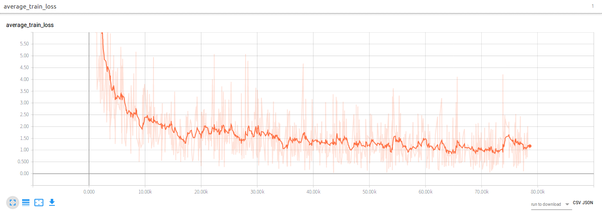
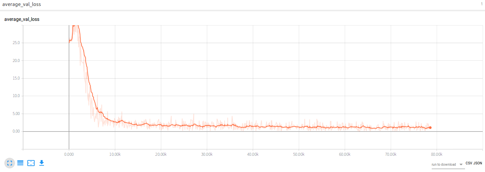

# CRNN_Tensorflow
This is a TensorFlow implementation of a Deep Neural Network for scene 
text recognition. It is  mainly based on the paper 
["An End-to-End Trainable Neural Network for Image-based Sequence Recognition and Its Application to Scene Text Recognition"](http://arxiv.org/abs/1507.05717). 
You can refer to the paper for architecture details. Thanks to 
the author [Baoguang Shi](https://github.com/bgshih).
  
The model consists of a CNN stage extracting features which are fed 
to an RNN stage (Bi-LSTM) and a CTC loss.

## Installation

This software has been developed on Ubuntu 16.04(x64) using python 3.5 and 
TensorFlow 1.12. Since it uses some recent features of TensorFlow it is 
incompatible with older versions.

The following methods are provided to install dependencies:

### Docker

There are Dockerfiles inside the folder `docker`. Follow the instructions 
inside `docker/README.md` to build the images.

### Conda

You can create a conda environment with the required dependencies using: 

```
conda env create -f crnntf-env.yml
```

### Pip

Required packages may be installed with

```
pip3 install -r requirements.txt
```

## Testing the pre-trained model

### Evaluate the model on the synth90k dataset
In this repo you will find a model pre-trained on the 
[Synth 90k](http://www.robots.ox.ac.uk/~vgg/data/text/)dataset. When the tfrecords
file of synth90k dataset has been successfully generated you may evaluated the
model by the following script

```
python tools/evaluate_shadownet.py --dataset_dir PATH/TO/YOUR/DATASET_DIR 
--weights_path PATH/TO/YOUR/MODEL_WEIGHTS_PATH
--char_dict_path PATH/TO/CHAR_DICT_PATH 
--ord_map_dict_path PATH/TO/ORD_MAP_PATH
--process_all 1 --visualize 1
```

The expected output is


### Test the model on the single image

If you want to test a single image you can do it with
```
python tools/test_shadownet.py --image_path PATH/TO/IMAGE 
--weights_path PATH/TO/MODEL_WEIGHTS
--char_dict_path PATH/TO/CHAR_DICT_PATH 
--ord_map_dict_path PATH/TO/ORD_MAP_PATH
```

### Example images
 
  

  

  

 

## Training your own model

#### Data preparation
Download the whole synth90k dataset [here](http://www.robots.ox.ac.uk/~vgg/data/text/)
And extract all th files into a root dir which should contain several txt file and
several folders filled up with pictures. Then you need to convert the whole 
dataset into tensorflow records as follows

```
python tools/write_text_features 
--dataset_dir PATH/TO/SYNTH90K_DATASET_ROOT_DIR
--save_dir PATH/TO/TFRECORDS_DIR
```

During converting all the source image will be scaled into (32, 100)

#### Training

For all the available training parameters, check `global_configuration/config.py`, 
then train your model with

```
python tools/train_shadownet.py --dataset_dir PATH/TO/YOUR/TFRECORDS
--char_dict_path PATH/TO/CHAR_DICT_PATH 
--ord_map_dict_path PATH/TO/ORD_MAP_PATH
```

If you wish, you can add more metrics to the training progress messages with 
`--decode_outputs 1`, but this will slow
training down. You can also continue the training process from a snapshot with

```
python tools/train_shadownet.py --dataset_dir PATH/TO/YOUR/TFRECORDS
--weights_path PATH/TO/YOUR/PRETRAINED_MODEL_WEIGHTS
--char_dict_path PATH/TO/CHAR_DICT_PATH --ord_map_dict_path PATH/TO/ORD_MAP_PATH
```

If you has multiple gpus in your local machine you may use multiple gpu training
to access a larger batch size input data. This will be supported as follows

```
python tools/train_shadownet.py --dataset_dir PATH/TO/YOUR/TFRECORDS
--char_dict_path PATH/TO/CHAR_DICT_PATH --ord_map_dict_path PATH/TO/ORD_MAP_PATH
--multi_gpus 1

```

The sequence distance is computed by calculating the distance between two 
sparse tensors so the lower the accuracy value
is the better the model performs. The training accuracy is computed by 
calculating the character-wise precision between
the prediction and the ground truth so the higher the better the model performs.

#### Export tensorflow saved model

You can convert the ckpt model into tensorflow saved model for tensorflow service
by running following script

```
bash tools/export_crnn_saved_model.sh
```

## Experiment

The original experiment run for 2000000 epochs, with a batch size of 32, 
an initial learning rate of 0.01 and exponential
decay of 0.1 every 500000 epochs. During training the `train loss` dropped as 
follows  



The `val loss` dropped as follows
  


## TODO

- [ ] Add new model weights trained on the whold synth90k dataset
- [ ] Add multiple gpu training scripts
- [ ] Add an online toy demo
- [ ] Add tensorflow service script
